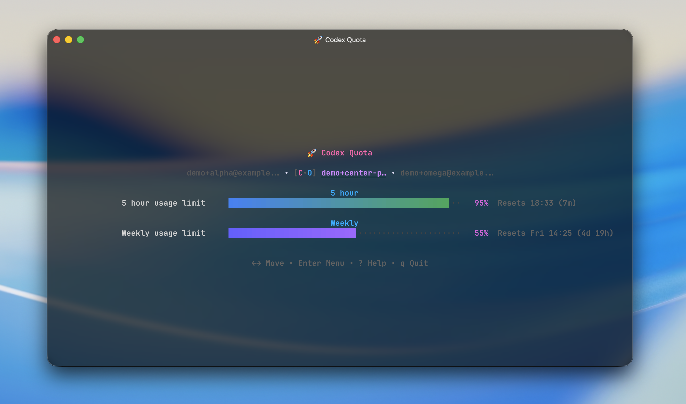

# CQ (Codex Quota)

A TUI for switching between Codex accounts and monitoring quota usage, written in Go using [Bubble Tea](https://github.com/charmbracelet/bubbletea).




## Features

- Fast account switching across many accounts
- Multi-target apply: set active account for Codex and/or OpenCode in one flow
- Accounts from local app storage, OpenCode auth, and Codex auth
- OAuth authentication via browser
- Two view modes: compact for many accounts, tabs for focused viewing when you have just a few.

## Installation

Homebrew:

```bash
brew install deLiseLINO/tap/codex-quota
```

Go install:

```bash
go install github.com/deLiseLINO/codex-quota/cmd/cq@latest
```

**Note:** Make sure your Go bin directory is available in `PATH`.

<details>
<summary>Build from source</summary>

```bash
git clone https://github.com/deLiseLINO/codex-quota.git
cd codex-quota
go install ./cmd/cq
```

</details>

## Usage

Run the app:

```bash
cq
```

Typical flow:

1. Press `n` to add/import account via OAuth.
2. Move between accounts with arrows.
3. Press `Enter` to open the actions menu for the active account and app-level actions.
4. Press `o` to apply the active account to Codex/OpenCode.
5. Use `r`/`R` to refresh quota and `?` for grouped keyboard help.

## Controls

- `↑` `↓` `←` `→` — both work for navigation; the UI highlights `↑/↓` in compact view and `←/→` in tabs view
- `Enter` — open actions menu for account and app-level actions
- `r` — refresh active account
- `R` — refresh all accounts
- `v` — switch view mode (also available via actions menu)
- `?` — open grouped keyboard help
- `q` / `Ctrl+C` — quit

Additional shortcuts:

- `h` `j` `k` `l` — Vim-style navigation
- `o` — apply active account to Codex/OpenCode
- `s` — refresh active account, then switch and apply another if it is exhausted
- `i` — toggle additional info
- `n` — add account (OAuth)
- `t` — open settings
- `x` — delete active account
- `u` — open update prompt when an update is available
- `Esc` — close modal/info/error/notice (or quit if nothing is open)

## OpenCode exhausted-event auto switch

For the most reliable `Auto switch exhausted` behavior with OpenCode, install the global OpenCode plugin:

```bash
cq opencode-plugin install
```

Then restart OpenCode. When OpenCode reports that the applied account is exhausted, `cq` force-switches to the best replacement account. If the plugin is installed, automatic switching waits for the OpenCode exhausted event; if it is not installed, the default legacy fallback switches when the applied account has `<= 3%` quota. Manual smart switch still uses the `<= 3%` threshold.

Useful commands:

```bash
cq opencode-plugin status
cq opencode-plugin uninstall
```
